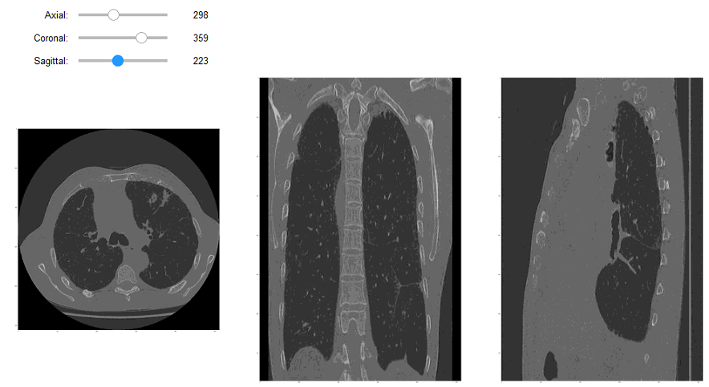

Volume Slicer Viewer
===================


<<<<<<< HEAD
This simple code is written in Jupyter to show the different anatomical planes of a DICOMDIR volume.
It is necessary to install `ipykernel`, `pydicom` and `ipywidgets` (using pip or conda)

Now, sometimes you need to enable the notebook extension for widgets (jupyter in my case):
```sh
jupyter nbextension enable --py widgetsnbextension
```
In the code, at beginning of the script, there is a path on my local machine for the DICOMDIR (in the variable filepath). This code considers only the 1st serie and the 1st study (just for testing purposes).

###### If you want to contribute to this project and make it better, your help is very welcome.
